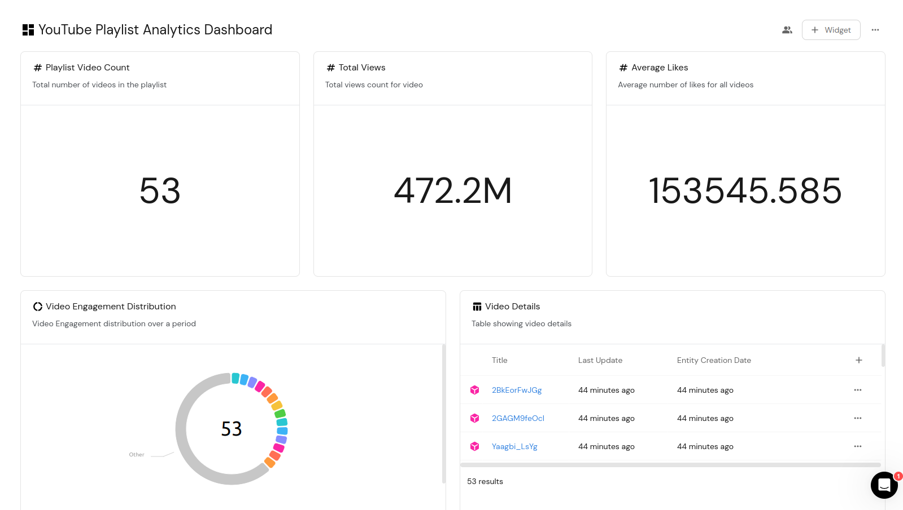

# YouTube Playlist & Videos catalogue in Port

A comprehensive guide for creating YouTube playlist & Videos catalogue in Port, including data modeling, ingestion, and visualization.

## Table of Contents
- [Overview](#overview)
- [Prerequisites](#prerequisites)
- [Part 1: Data Modeling in Port](#part-1-data-modeling-in-port)
  - [Creating the Playlist Blueprint](#creating-the-playlist-blueprint)
  - [Creating the Video Blueprint](#creating-the-video-blueprint)
  - [Blueprint YAML Representations](#blueprint-yaml-representations)
- [Part 2: GitHub Workflow Setup](#part-2-github-workflow-setup)
  - [Setting Up Repository Secrets](#setting-up-repository-secrets)
  - [Creating the Workflow File](#creating-the-workflow-file)
- [Part 3: Data Ingestion](#part-3-data-ingestion)
- [Part 4: Creating Visualizations](#part-4-creating-visualizations)
- [Value Proposition](#value-proposition)
- [Troubleshooting](#troubleshooting)
- [Relevant Links](#relevant-links)
- [Author](#author)

## Overview

This guide demonstrates how to create a comprehensive YouTube playlist tracking system in Port. You'll learn how to:
- Model playlist and video data using Port blueprints
- Set up automated data ingestion using GitHub Actions
- Create meaningful visualizations of your YouTube data
- Monitor playlist and video performance metrics

## Prerequisites

Before starting this integration, ensure you have:

1. **Port Account**
   - Sign up at [app.getport.io](https://app.getport.io)
   - Verify your email and log in

   **Installing Port's GitHub App**
   - Log into your Port account at [app.getport.io](https://app.getport.io)
   - Navigate to "Data Sources" in the left sidebar
   - Find and click on "GitHub" under the available integrations
   - Click "Install GitHub App"
   - You will be redirected to GitHub's app installation page
   - Choose whether to install the app on all repositories or select specific ones
   - If selecting specific repositories:
     - Choose the repositories you want to monitor
     - Click "Install & Authorize"
   - Return to Port's "Data Sources" page
   - Check that GitHub appears as a connected integration
   - The status should show as "Active"


2. **GitHub Account**
   - Active GitHub account
   - Repository where you'll set up the workflow

3. **API Keys and Credentials**
   - YouTube Data API v3 key
     - Go to [Google Cloud Console](https://console.cloud.google.com)
     - Create a project or select existing one
     - Enable YouTube Data API v3
     - Create API credentials
   - Port API key
   - Port Client ID and Secret

## Part 1: Data Modeling in Port

### Creating the Playlist Blueprint

1. **Navigate to Builder**
   - Log into Port
   - Click "Builder" in the left sidebar
   - Click "+ New Blueprint"

2. **Configure Basic Settings**
   - Name: "playlist"
   - Display Name: "Playlist"
   - Description: "YouTube playlist description"
   - Icon: Select "Microservice" from the dropdown

3. **Add Properties**
   - Click "Add Property"
   - Add the following properties:

   a) Title Property
   - Name: "title"
   - Type: "String"
   - Required: Yes
   - Description: "Title of the playlist"
   
   b) Description Property
   - Name: "description"
   - Type: "String"
   - Required: No
   - Description: "The description of the playlist"
   
   c) Thumbnail URL Property
   - Name: "thumbnail_url"
   - Type: "String"
   - Format: "URL"
   - Required: No
   - Description: "The URL of the playlist's thumbnail image"
   
   d) Video Count Property
   - Name: "video_count"
   - Type: "Number"
   - Required: No
   - Description: "The number of videos in the playlist"

4. **Save Blueprint**
   - Click "Create" at the bottom of the page
   - Verify the blueprint appears in your blueprint list

### Creating the Video Blueprint

1. **Start New Blueprint**
   - Click "+ New Blueprint"
   - Name: "video"
   - Display Name: "Video"
   - Description: "YouTube video blueprint"
   - Icon: Select "Microservice"

2. **Add Properties**
   - Add the following properties:

   a) Title Property
   - Name: "title"
   - Type: "String"
   - Required: Yes
   - Description: "The title of the video"
   
   b) Description Property
   - Name: "description"
   - Type: "String"
   - Required: No
   - Description: "The description of the video"
   
   c) Thumbnail URL Property
   - Name: "thumbnail_url"
   - Type: "String"
   - Format: "URL"
   - Required: No
   - Description: "The URL of the video's thumbnail image"
   
   d) Duration Property
   - Name: "duration"
   - Type: "String"
   - Required: No
   - Description: "The duration of the video"
   
   e) View Count Property
   - Name: "view_count"
   - Type: "Number"
   - Required: No
   - Description: "The number of views the video has received"
   
   f) Like Count Property
   - Name: "like_count"
   - Type: "Number"
   - Required: No
   - Description: "The number of likes the video has received"
   
   g) Comment Count Property
   - Name: "comment_count"
   - Type: "Number"
   - Required: No
   - Description: "The number of comments the video has received"

3. **Add Relation**
   - Click "Add Relation"
   - Name: "belongs_to"
   - Title: "Belongs To"
   - Description: "Relationship between video and playlist"
   - Target Blueprint: Select "playlist"
   - Required: Yes
   - Many: No

4. **Save Blueprint**
   - Click "Create"
   - Verify the blueprint appears with all properties and relations

### Blueprint YAML Representations

When creating the blueprints in Port, you can also use these YAML definitions:

#### Playlist Blueprint YAML
```yaml
identifier: playlist
description: "Youtube playlist description"
title: "playlist"
icon: "Microservice"
schema:
  properties:
    title:
      type: "string"
      title: "title"
      description: "title of the playlist"
    description:
      type: "string"
      title: "description"
      description: "the description of the playlist"
    thumbnail_url:
      type: "string"
      title: "thumbnailUrl"
      description: "the URL of the playlist's thumbnail image"
      format: "url"
    video_count:
      type: "number"
      title: "videoCount"
      description: "The number of videos in the playlist"
  required:
    - "title"
mirrorProperties: {}
calculationProperties: {}
aggregationProperties: {}
relations: {}
```

#### Video Blueprint YAML
```yaml
identifier: "video"
description: "youtube video blueprint"
title: "video"
icon: "Microservice"
schema:
  properties:
    title:
      type: "string"
      title: "title"
      description: "the title of the video"
    description:
      type: "string"
      title: "description"
      description: "the description of the video"
    thumbnail_url:
      type: "string"
      title: "thumbnailUrl"
      description: "The URL of the video's thumbnail image"
      format: "url"
    duration:
      type: "string"
      title: "duration"
      description: "the duration of the video"
    view_count:
      type: "number"
      title: "viewCount"
      description: "The number of views the video has received"
    like_count:
      type: "number"
      title: "likeCount"
      description: "The number of likes the video has received"
    comment_count:
      type: "number"
      title: "commentCount"
      description: "The number of comments the video has received"
  required:
    - "title"
mirrorProperties: {}
calculationProperties: {}
aggregationProperties: {}
relations:
  belongs_to:
    title: "Belongs To"
    description: "relationship between video and playlist"
    target: "playlist"
    required: true
    many: false
```

## Part 2: GitHub Workflow Setup

### Setting Up Repository Secrets

1. **Navigate to Repository Settings**
   - Go to your GitHub repository
   - Click "Settings"
   - Click "Secrets and variables" in the left sidebar
   - Select "Actions"

2. **Add Required Secrets**
   - Click "New repository secret"
   - Add each of these secrets:
     ```
     YOUTUBE_API_KEY (Your YouTube Data API key)
     PORT_API_KEY (Your Port API key)
     PORT_CLIENT_ID (Your Port Client ID)
     PORT_CLIENT_SECRET (Your Port Client Secret)
     ```

### Creating the Workflow File

1. **Create Workflow Directory**
   - In your repository, create directory: `.github/workflows`

2. **Create Workflow File**
   - Create new file: `ingest.yml`
   - Add the following GitHub Actions workflow configuration:

```yaml
name: Ingest YouTube Playlist

on:
  schedule:
    - cron: "0 0 * * *"  # Runs daily at midnight UTC
  workflow_dispatch:      # Allows manual triggering

jobs:
  ingest-youtube-data:
    runs-on: ubuntu-latest
    
    env:
      YOUTUBE_API_KEY: ${{ secrets.YOUTUBE_API_KEY }}
      PORT_API_KEY: ${{ secrets.PORT_API_KEY }}
      PORT_CLIENT_ID: ${{ secrets.PORT_CLIENT_ID }}
      PORT_CLIENT_SECRET: ${{ secrets.PORT_CLIENT_SECRET }}
    
    steps:
    - name: Checkout repository
      uses: actions/checkout@v3
    
    - name: Set up Python
      uses: actions/setup-python@v4
      with:
        python-version: '3.9'
    
    - name: Install dependencies
      run: |
        python -m pip install --upgrade pip
        pip install google-api-python-client requests
    
    - name: Run YouTube Port ingestion
      run: |
        python << 'EOF'
        import os
        import logging
        import requests
        from googleapiclient.discovery import build
        from datetime import datetime
        import sys
        import time

        # Set up logging
        logging.basicConfig(level=logging.INFO,
            format='%(asctime)s - %(levelname)s - %(message)s',
            stream=sys.stdout
        )
        logger = logging.getLogger(__name__)

        class YouTubePortIngestion:
            def __init__(self):
                self.PLAYLIST_ID = 'PL5ErBr2d3QJH0kbwTQ7HSuzvBb4zIWzhy'  # Replace with your playlist ID
                self.port_api_url = "https://api.getport.io/v1"
                self.port_api_key = os.environ['PORT_API_KEY']
                self.port_client_id = os.environ.get('PORT_CLIENT_ID')
                self.port_client_secret = os.environ.get('PORT_CLIENT_SECRET')
                self.playlist_blueprint_identifier = "playlist"
                self.video_blueprint_identifier = "video"
                self.access_token = None
                try:
                    self.youtube = build('youtube', 'v3', developerKey=os.environ['YOUTUBE_API_KEY'])
                    self.refresh_port_token()
                    logger.info("Successfully initialized clients")
                except KeyError as e:
                    logger.error(f"Missing environment variable: {str(e)}")
                    raise
                except Exception as e:
                    logger.error(f"Error initializing clients: {str(e)}")
                    raise

            def refresh_port_token(self):
                try:
                    if self.port_client_id and self.port_client_secret:
                        auth_url = f"{self.port_api_url}/auth/access_token"
                        auth_data = {
                            "clientId": self.port_client_id,
                            "clientSecret": self.port_client_secret
                        }
                        response = requests.post(auth_url, json=auth_data)
                        if response.status_code == 200:
                            self.access_token = response.json().get('accessToken')
                            logger.info("Successfully refreshed Port access token")
                        else:
                            raise Exception(f"Failed to get access token: {response.text}")
                    else:
                        self.access_token = self.port_api_key
                except Exception as e:
                    logger.error(f"Error refreshing token: {str(e)}")
                    raise

            def get_headers(self):
                return {
                    'Authorization': f"Bearer {self.access_token}",
                    'Content-Type': 'application/json'
                }

            def handle_response(self, response, operation):
                if response.status_code == 401:
                    logger.info("Token expired, refreshing...")
                    self.refresh_port_token()
                    return False
                elif response.status_code not in [200, 201]:
                    logger.error(f"Error {response.status_code}: {response.text}")
                    raise Exception(f"Failed to {operation}: {response.text}")
                return True

            def fetch_playlist_info(self):
                try:
                    playlist_response = self.youtube.playlists().list(
                        part='snippet,contentDetails',
                        id=self.PLAYLIST_ID
                    ).execute()
                    
                    if not playlist_response.get('items'):
                        raise Exception(f"No playlist found with ID {self.PLAYLIST_ID}")
                    
                    playlist = playlist_response['items'][0]
                    playlist_data = {
                        'identifier': self.PLAYLIST_ID,
                        'properties': {
                            'title': playlist['snippet']['title'],
                            'description': playlist['snippet']['description'],
                            'thumbnail_url': playlist['snippet']['thumbnails']['default']['url'],
                            'video_count': playlist['contentDetails']['itemCount']
                        }
                    }
                    logger.info(f"Fetched playlist data: {playlist_data}")
                    return playlist_data
                except Exception as e:
                    logger.error(f"Error fetching playlist info: {str(e)}")
                    raise

            def fetch_video_details(self, video_id):
                try:
                    video_response = self.youtube.videos().list(
                        part='statistics,contentDetails,snippet',
                        id=video_id
                    ).execute()
                    return video_response['items'][0] if video_response.get('items') else None
                except Exception as e:
                    logger.error(f"Error fetching video details for {video_id}: {str(e)}")
                    return None

            def get_entity(self, entity_id, blueprint_identifier):
                try:
                    url = f"{self.port_api_url}/blueprints/{blueprint_identifier}/entities/{entity_id}"
                    response = requests.get(url, headers=self.get_headers())
                    if response.status_code == 200:
                        return response.json()
                    elif response.status_code == 404:
                        return None
                    else:
                        logger.error(f"Error getting entity: {response.text}")
                        return None
                except Exception as e:
                    logger.error(f"Error in get_entity: {str(e)}")
                    return None

            def update_or_create_entity(self, entity_data, blueprint_identifier):
                max_retries = 3
                retry_count = 0
                
                while retry_count < max_retries:
                    try:
                        url = f"{self.port_api_url}/blueprints/{blueprint_identifier}/entities"
                        headers = self.get_headers()
                        
                        logger.info(f"Attempting to create/update entity with data: {entity_data}")
                        
                        existing_entity = self.get_entity(entity_data['identifier'], blueprint_identifier)
                        
                        if existing_entity:
                            logger.info(f"Updating existing entity with ID {entity_data['identifier']}")
                            response = requests.patch(
                                f"{url}/{entity_data['identifier']}", 
                                json=entity_data, 
                                headers=headers
                            )
                        else:
                            logger.info(f"Creating new entity with ID {entity_data['identifier']}")
                            response = requests.post(url, json=entity_data, headers=headers)
                        
                        if self.handle_response(response, "create/update entity"):
                            logger.info(f"Successfully handled entity with ID {entity_data['identifier']}")
                            return
                        
                        retry_count += 1
                        if retry_count < max_retries:
                            time.sleep(1)
                            
                    except Exception as e:
                        logger.error(f"Error in update_or_create_entity: {str(e)}")
                        retry_count += 1
                        if retry_count < max_retries:
                            time.sleep(1)
                        else:
                            raise

            def process_playlist_videos(self):
                try:
                    playlist_items_request = self.youtube.playlistItems().list(
                        part='snippet,contentDetails',
                        playlistId=self.PLAYLIST_ID,
                        maxResults=50
                    )
                    
                    while playlist_items_request:
                        playlist_items_response = playlist_items_request.execute()
                        
                        for item in playlist_items_response.get('items', []):
                            video_id = item['contentDetails']['videoId']
                            video_details = self.fetch_video_details(video_id)
                            
                            if video_details:
                                video_data = {
                                    'identifier': video_id,
                                    'title': video_details['snippet']['title'],
                                    'properties': {
                                        'title': video_details['snippet']['title'],
                                        'description': video_details['snippet']['description'],
                                        'thumbnail_url': video_details['snippet']['thumbnails']['default']['url'],
                                        'duration': video_details['contentDetails']['duration'],
                                        'view_count': int(video_details['statistics'].get('viewCount', 0)),
                                        'like_count': int(video_details['statistics'].get('likeCount', 0)),
                                        'comment_count': int(video_details['statistics'].get('commentCount', 0))
                                    },
                                    'relations': {
                                        'belongs_to': self.PLAYLIST_ID
                                    }
                                }
                                
                                self.update_or_create_entity(video_data, self.video_blueprint_identifier)
                                logger.info(f"Processed video: {video_id}")
                                time.sleep(0.1)  # Rate limiting
                        
                        playlist_items_request = self.youtube.playlistItems().list_next(
                            playlist_items_request, playlist_items_response)
                        
                except Exception as e:
                    logger.error(f"Error processing playlist videos: {str(e)}")
                    raise

            def run(self):
                try:
                    # First update/create playlist entity
                    playlist_data = self.fetch_playlist_info()
                    self.update_or_create_entity(playlist_data, self.playlist_blueprint_identifier)
                    
                    # Then process all videos in the playlist
                    self.process_playlist_videos()
                    
                    logger.info("Successfully completed YouTube Port ingestion")
                    
                except Exception as e:
                    logger.error(f"Error during ingestion run: {str(e)}")
                    raise

        if __name__ == "__main__":
            try:
                ingestion = YouTubePortIngestion()
                ingestion.run()
            except Exception as e:
                logger.error(f"Failed to complete ingestion: {str(e)}")
                sys.exit(1)
        EOF
```

3. **Important Configuration Notes**
   - Replace `PLAYLIST_ID` in the code with your actual YouTube playlist ID
   - The workflow runs daily at midnight UTC (`cron: "0 0 * * *"`)
   - Manual triggering is enabled through `workflow_dispatch`
   - The script includes retry logic and rate limiting for API calls
   - Comprehensive error handling and logging is implemented

4. **Rate Limiting and Quotas**
   - The script includes a 0.1-second delay between video processing
   - YouTube API has daily quota limits - monitor your usage
   - Port API calls include retry logic for better reliability


## Value Proposition

Implementing this YouTube playlist integration with Port provides several key benefits:

1. **Centralized Content Management**
   - Track all your YouTube playlists and videos in one place
   - Maintain organized catalog of video content
   - Easy access to video metrics and performance data

2. **Performance Monitoring**
   - Real-time tracking of view counts and engagement metrics
   - Monitor playlist growth and popularity
   - Track audience engagement through likes and comments

3. **Data-Driven Insights**
   - Identify top-performing videos
   - Analyze engagement patterns
   - Make informed decisions about content strategy

4. **Automated Tracking**
   - Daily automatic updates of video metrics
   - No manual data entry required
   - Always up-to-date analytics


## Part 4: Creating Visualizations

After the data is ingested, create these visualizations to monitor your YouTube content:

### 1. Video Count Metric
1. Navigate to "Dashboards" in Port
2. Click "+ Add Widget"
3. Select "Number Chart"
4. Configure:
   - Title: "Total Videos"
   - Under Query Definition:
     - Blueprint: Select "video"
     - Aggregation: Select "Count"

### 2. Average Likes Metric
1. Click "+ Add Widget"
2. Select "Number Chart"
3. Configure:
   - Title: "Average Likes"
   - Under Query Definition:
     - Blueprint: Select "video"
     - Aggregation: Select "Average"
     - Property: Select "like_count"

### 3. Video Details Table
1. Click "+ Add Widget"
2. Select "Table"
3. Configure:
   - Title: "Video Details"
   - Select Blueprint: "video"
   - Add Columns:
     - Title
     - View Count
     - Like Count
     - Comment Count
     - Duration

### 4. Engagement Distribution Pie Chart
1. Click "+ Add Widget"
2. Select "Pie Chart"
3. Configure:
   - Title: "Video Engagement Distribution"
   - Select Blueprint: "video"
   - Group By: "view_count"

### YouTube Playlist Analytics Dashboard Layout



## Relevant Links

1. **Port Resources**
   - [Port Documentation](https://docs.getport.io/)
   - [Port API Reference](https://api-docs.getport.io/)
   - [Port Blueprints Guide](https://docs.getport.io/build-your-software-catalog/define-your-data-model/setup-blueprint/)

2. **YouTube Resources**
   - [YouTube Data API Documentation](https://developers.google.com/youtube/v3)
   - [YouTube API Quotas and Compliance](https://developers.google.com/youtube/v3/getting-started#quota)

3. **GitHub Resources**
   - [GitHub Actions Documentation](https://docs.github.com/en/actions)
   - [GitHub Secrets Management](https://docs.github.com/en/actions/security-guides/encrypted-secrets)
   - [GitHub Repo link](https://github.com/e-ian/port-doc/blob/main/youtube_playlist_data.md)
   

## Troubleshooting

Common issues and their solutions:

1. **Workflow Fails to Run**
   - Check if all secrets are properly set in GitHub
   - Verify YouTube API key has necessary permissions
   - Ensure Port credentials are valid

2. **Data Not Appearing in Port**
   - Verify blueprint definitions match the ingestion code
   - Check workflow logs for any API errors
   - Ensure relations are properly configured

3. **Visualization Issues**
   - Refresh the dashboard
   - Verify data is present in Port
   - Check widget configurations

## Author

**Emmanuel Ogwal**  
Email: ianemma70@gmail.com

---

*Last Updated: November 8, 2024*